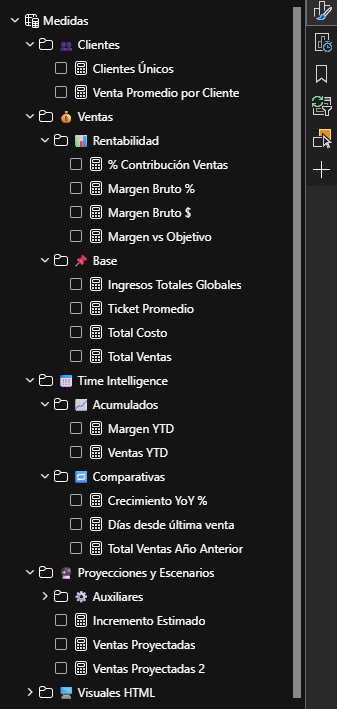

# Adventure Works: Sales Intelligence & Forecasting Dashboard 📊

## 📌 Descripción del Proyecto
Este proyecto presenta un análisis integral de inteligencia de ventas utilizando el dataset de **Adventure Works**. 
El objetivo principal fue transformar datos brutos en una herramienta de toma de decisiones estratégica, permitiendo visualizar el rendimiento histórico y proyectar escenarios futuros.

---

## 🛠️ Tecnologías Utilizadas
* **SQL Server (T-SQL):** Extracción, limpieza y transformación de datos (ETL).
* **Power BI:** Modelado de datos (Esquema en Estrella) y visualización avanzada.
* **DAX:** Medidas complejas, inteligencia de tiempo y parámetros de simulación.
* **HTML/CSS:** Diseño de KPIs personalizados y Tooltips dinámicos.

---

## 🚀 Características Principales

### 1. Análisis de Rentabilidad Crítica
Identificación visual mediante un **Treemap dinámico** que cruza el volumen de ventas con el margen de beneficio. 
> **Insight:** Se detectó que la categoría de *Bicicletas* lidera en ingresos pero requiere optimización de costos debido a su bajo margen relativo.

### 2. Simulador de Escenarios (What-if)
Implementación de parámetros que permiten ajustar el crecimiento porcentual esperado, actualizando instantáneamente las proyecciones de ventas y comparándolas con el rendimiento del año anterior.

### 3. KPIs Ejecutivos Modernos
Diseño de tarjetas de indicadores utilizando contenedores HTML para superar las limitaciones visuales estándar, proporcionando una interfaz limpia y profesional.

---

## 📈 Visualización del Dashboard

.png)

*Vista del análisis de ventas 2012 con simulación activa.*

---

## 🗄️ Estructura del Repositorio
* `AdventureWorks_Sales_Intelligence_v1.0.pbix`: Archivo principal de Power BI con el modelo y visualizaciones.
* `Sales and Customers.sql`: Script de SQL Server con la lógica de transformación de datos.
* `Dashboard -Sales.png`: Captura de pantalla del tablero principal.
* `Vista de modelo.png`: Imagen del esquema en estrella (Star Schema) implementado.
* `Tablas y medidas.png`: Detalle de la organización de las medidas DAX.

---

---

## 🏗️ Arquitectura Técnica

### Modelo de Datos
Se implementó un esquema en estrella para optimizar el rendimiento de las consultas y facilitar el análisis temporal.

### Organización de Medidas
Las métricas se agruparon en tablas de medidas dedicadas para mantener la escalabilidad del proyecto.

## 💡 Conclusión
Este proyecto demuestra habilidades en el ciclo completo de análisis de datos, desde la ingeniería de datos en SQL hasta el diseño de interfaces de usuario (UI/UX) enfocadas en negocios.
